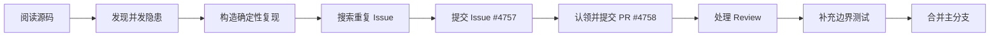
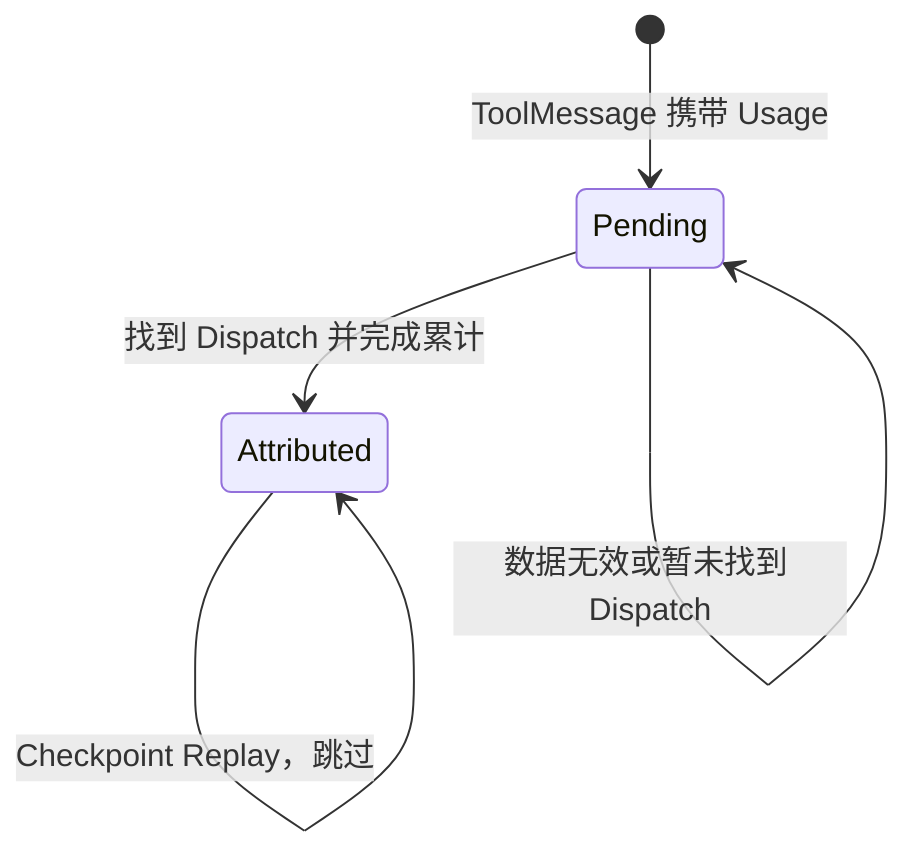
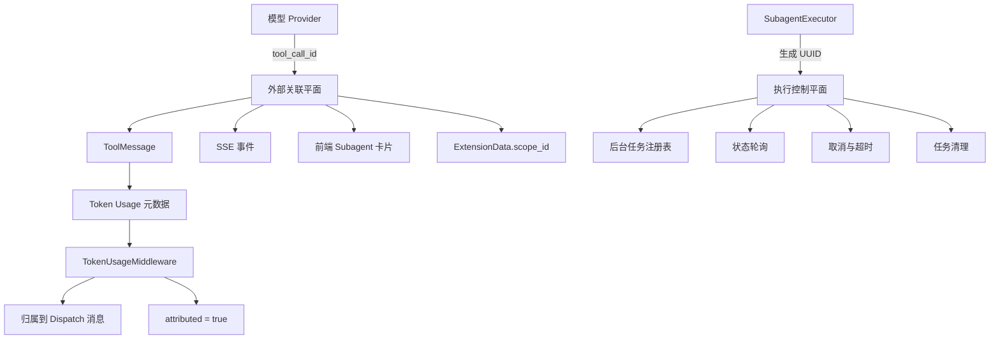

# 一次 DeerFlow 开源贡献：锁住字典之后，任务为什么还是串了

一个 Agent 运行启动了后台 Subagent，另一个互不相关的运行也启动了后台 Subagent。两边都很正常，任务注册表的读写也全部加了锁。

但只要模型服务商碰巧给这两次工具调用返回相同的 `tool_call_id`，第二个任务就可能覆盖第一个任务。接下来，运行 A 取消的可能是运行 B，A 清理的也可能是 B；前端则会看到两边进度混在一起，或者突然收到一句：`Task disappeared from background tasks`。

这就是我这次给字节跳动开源项目 DeerFlow 提交的并发缺陷。2026 年 8 月 10 日，我提交了 [Issue #4757](https://github.com/bytedance/deer-flow/issues/4757) 和 [PR #4758](https://github.com/bytedance/deer-flow/pull/4758)；经过复现、Review、补测试和两轮边界修正，PR 于 8 月 12 日合并。

它表面上是一个 ID 冲突，背后却是 Agent Harness 中很典型的一类问题：**锁保护的是容器，唯一身份保护的是任务所有权。线程安全不能替代身份建模。**

## 这次贡献修了什么

DeerFlow 会把部分 Subagent 放到后台运行。你可以把 Subagent 理解成主 Agent 临时派出去的一名专门执行者：主流程把一项子任务交给它，随后通过轮询获得进度，需要时还可以取消、超时或清理它。

为了管理这些后台任务，服务端有一个进程级注册表：

```python
_background_tasks: dict[str, SubagentResult] = {}
```

原来的调用链把模型 Provider 返回的 `tool_call_id` 直接当成 `task_id`，再用它作为注册表的唯一键：

```python
with _background_tasks_lock:
    _background_tasks[task_id] = result
```

`tool_call_id` 的本职是关联一次模型工具调用和它的返回结果。它像快递面单上的查询号：在约定范围内，系统可以靠它把请求、事件和页面展示串起来；但如果上游没有承诺它在整个服务进程中全局唯一，就不能直接把它当成仓库里每件货物永久且唯一的储位编号。

原实现的问题正出在这里。不同父 Run 之间只要复用了同一个 Provider ID，后写入的任务就会合法地覆盖前一个任务。锁没有失效，它忠实地保证了两次写入不会同时破坏字典结构；只是两次写入使用了同一个业务主键。

| 问题层次 | 要保证什么 | 加锁能否解决 |
| --- | --- | --- |
| 数据结构并发安全 | 多个线程读写字典时不破坏内部状态 | 能 |
| 任务身份唯一性 | 两次后台执行不会命中同一个键 | 不能 |
| 任务所有权隔离 | 轮询、取消、超时和清理只影响自己的任务 | 取决于身份设计 |

因此，真正需要修的不是“有没有锁”，而是“谁有资格成为内部执行的主键”。

## 先把理论风险变成确定性复现

看到可疑代码不等于证明缺陷。并发问题尤其容易出现一种尴尬：逻辑上好像会出错，实际运行几十次又不一定撞得上。

这次没有靠随机压测碰运气，而是构造了一个可控调度器，让后台闭包先注册、暂不执行：

1. 创建两个代表不同父 Run 的 `SubagentExecutor`。
2. 让两个任务都使用 `same-provider-tool-call-id`。
3. 等它们完成注册后，再按指定顺序释放后台闭包。
4. 分别检查结果归属、取消信号和清理行为。

这样就能稳定重现原实现的错误链条：

```text
Run B 覆盖 Run A 的注册项
Run A 的 Worker 重新查表时拿到 Run B 的 Result
取消 A 实际设置了 B 的 cancel_event
清理 A 又删除了 B 的注册项
```

提交 Issue 后，我又沿真实 Gateway、SSE 和前端链路补了一次复现。SSE 是服务端持续向浏览器推送事件的一种连接方式，类似网页一直开着一条只收消息的广播线路。真实链路中，一个 Run 会收到混杂进度，另一个 Run 则可能找不到自己的后台任务。

到这一步，问题才从“代码看起来不稳”变成了可重复、可观察、可写回归测试的缺陷。

## 从发现问题到 PR 合并

这次贡献并不是看到代码后直接提交修改，而是走完了一次完整的开源协作流程：



在报 Issue 前，先搜索项目已有 Issue 和 PR，确认没有相同报告；再固定复现所基于的提交 `17531d7c`，写清触发条件、实际结果、期望行为和建议测试。Issue 不是一句“这里可能有 bug”，而是一份维护者可以复跑和判断影响范围的最小证据包。

PR 的初始方案也尽量收窄：服务端为每次 `execute_async` 生成独立 UUID，后台注册、轮询、取消、超时和清理全部使用这个内部 `execution_id`；Provider 的 `tool_call_id` 则继续用于 `ToolMessage`、SSE 和前端关联。

核心方向很快得到认可，但真正让方案完整的，是后续 Review 暴露出的两个边界。

## Review 补上的第一块：扩展兼容性

初版修复把 `SubagentResult.task_id` 改成了服务端生成的 `execution_id`。内部注册表安全了，但 `ExtensionData.scope_id` 原来同样读取这个字段。

如果直接合并，公开扩展接口的含义会悄悄改变：

```text
修改前：ExtensionData.scope_id = provider tool_call_id
修改后：ExtensionData.scope_id = server execution_id
```

DeerFlow 内部当时没有明显消费者依赖旧语义，不代表社区扩展也没有。一个只看内部调用链“完全正确”的重构，仍可能破坏外部使用者。

最终实现为 `SubagentResult` 增加独立的 `external_task_id`。内部执行继续使用 `task_id` 表示服务端 UUID，Extension Store 则优先使用外部关联身份：

```python
@dataclass
class SubagentResult:
    task_id: str
    external_task_id: str | None = field(default=None, kw_only=True)
```

这不是为了多保存一个字段，而是把两种原本混在一起的语义正式拆开：

- `execution_id` 回答“服务端正在控制哪一次执行”；
- `external_task_id` 回答“这次执行对应模型协议里的哪次工具调用”。

内部所有权要唯一，外部关联要稳定，两者不必共用同一个 ID。

## Review 补上的第二块：重放幂等性

原实现还有一份按 `tool_call_id` 建索引的进程级 Token Usage Cache，也存在跨 Run 污染的风险。修复把 Subagent 的 Token 用量放进了持久化 `ToolMessage`，再由 Middleware 归属到对应的 Dispatch 消息。

这里的 Middleware 可以理解成消息进入或离开主流程时经过的一道处理工序。它负责读取 Subagent 用量，并累计到正确的主 Agent 调用上。

但存储位置一变，读取语义也变了：

```text
旧缓存：读取并 pop，此后数据消失
消息状态：读取后仍然存在，Checkpoint Replay 时会再次出现
```

Checkpoint Replay 指系统从保存点恢复后，重新处理已经持久化的消息。它像账本断电后从上一页继续核账：如果没有“这笔已经入账”的标记，同一笔 12 tokens 就可能第二次再加 12，最终变成 24。

针对这个问题，最终版本增加了消息级归属标记 `subagent_token_usage_attributed`。只有成功找到对应 Dispatch 并完成累计后才标记已消费；后续重放看到标记就跳过。如果数据暂时无效或找不到归属，则不提前标记，给之后的恢复留下机会。



这件事让我更清楚地意识到：**把数据从一次性内存搬进持久化状态，不只是换一个保存位置，还要重新设计消费、重试和幂等语义。**

## 最终不是一个 ID，而是三个平面

最终合并的设计可以看成三套各司其职的身份与状态：



| 平面 | 使用的身份或状态 | 主要职责 |
| --- | --- | --- |
| 外部关联平面 | Provider `tool_call_id` | 模型协议、ToolMessage、SSE、前端和扩展关联 |
| 执行控制平面 | 服务端 `execution_id` | 注册、轮询、取消、超时和清理 |
| 持久化状态平面 | Message metadata | Token Usage 保存、归属与重放幂等 |

为什么不直接使用 `(thread_id, run_id, tool_call_id)` 这样的复合 Key？因为 `run_id` 并非所有路径都稳定存在，调用者也必须一路携带完整命名空间。后台执行本身没有可靠的外部自然主键，为每次执行生成服务端 UUID，更直接地表达了“一次执行就是一个独立所有权单元”。

一句话概括就是：**外部 ID 负责关联，内部 UUID 负责所有权，消息元数据负责可恢复状态。**

## 测试的不是 UUID，而是隔离契约

如果测试只断言“代码生成了 UUID”，实现稍微换一种写法就会失效，也无法证明原来的串线真的消失。

这次回归测试关注的是外部可观察行为：相同 `external_task_id` 是否产生不同执行身份；取消 A 是否只设置 A 的信号；清理 A 后 B 是否仍在；后台控制是否使用 `execution_id`，而 SSE 和 `ToolMessage` 是否仍保留 Provider ID；两个 Run 使用相同 `tool_call_id` 时，Token Usage 能否分别归属；Checkpoint 重放后，用量是否保持不变。

PR 记录显示，Lint、`git diff --check` 和 235 项聚焦测试通过。本地没有完成 11,180 项全量测试，因此这里不把“聚焦测试通过”写成“所有测试通过”；最终是否进入主分支，仍由项目 CI 和维护者审批决定。

2026 年 8 月 12 日，维护者给出 Approved，PR 随后合并，Merge commit 为 [`88252e9`](https://github.com/bytedance/deer-flow/commit/88252e9b318d34e7e1867155ad2c77993320788e)。

## 这次开源贡献真正学到什么

第一，**先证明，再报告。** 好 Issue 的价值不在于猜得准，而在于让别人能以较低成本确认问题。固定版本、确定性调度、最小复现和可观察结果，比“高并发下偶尔出错”更容易推动修复。

第二，**外部 ID 默认不等于内部主键。** 模型的 `tool_call_id`、Webhook Event ID、第三方请求 ID 或客户端临时 ID，都可能只在某个局部范围内唯一。除非协议明确保证作用域，否则不要直接拿它们做进程级注册表、分布式锁、取消句柄或资源所有权标识。

第三，**Review 不只是找错，也是发现边界。** 这次 reviewer 没有推翻核心方案，而是沿着变更继续追问：扩展接口的旧语义怎么办？持久化消息重放会不会重复计数？正是这两个问题，让 PR 从修一个字典覆盖，变成更完整的身份分层。

第四，**测试要守住系统契约。** 变量名和函数调用会变，但“A 不能取消 B”“重放不能重复计费”“内部改造不能悄悄改变外部关联”这些约束更长久。

这次提交使用了 Codex 协助阅读、验证和整理修改，我也在 PR 中公开说明了这一点。AI 可以提高搜索和实现速度，但提交者仍要理解每一处变更、核验测试结果，并对最终代码负责。对开源协作来说，披露工具并不削弱贡献；真正重要的是证据是否可复查、判断是否站得住、责任是否有人承担。

## 适用边界

这套拆分不是说所有系统都必须同时保存三个 ID。单进程、无并发、无持久化重放的小工具，可能根本不需要这套复杂度。

真正需要警惕的是：系统一旦同时存在多个父 Run、异步后台任务、取消与清理、跨进程状态或 Checkpoint Replay，就不能再把“看起来像唯一”的外部字符串当成所有权。此时应该明确写下每个 ID 的作用域、生成者、生命周期和消费者，并用跨 Run 测试验证隔离。

锁当然仍然重要。它解决并发访问容器的问题；只是它解决不了两个任务为什么被分配到同一把钥匙。把这两件事分开，才是这次修复最值得带走的结论。

## References / 相关链接

- ZeroMadLife. [Issue #4757: concurrent subagent runs can collide on reused tool_call_id](https://github.com/bytedance/deer-flow/issues/4757), 创建于 2026-08-10，关闭于 2026-08-12。
- ZeroMadLife. [PR #4758: fix(subagents): isolate background tasks from reused tool call IDs](https://github.com/bytedance/deer-flow/pull/4758), 创建于 2026-08-10，合并于 2026-08-12。
- ByteDance DeerFlow. [Merge commit `88252e9`](https://github.com/bytedance/deer-flow/commit/88252e9b318d34e7e1867155ad2c77993320788e), 2026-08-12。
- ByteDance DeerFlow. [问题复现所基于的提交 `17531d7`](https://github.com/bytedance/deer-flow/tree/17531d7c118d6111b863f945ff910a7889a235b0), 2026-08-10 核验。
